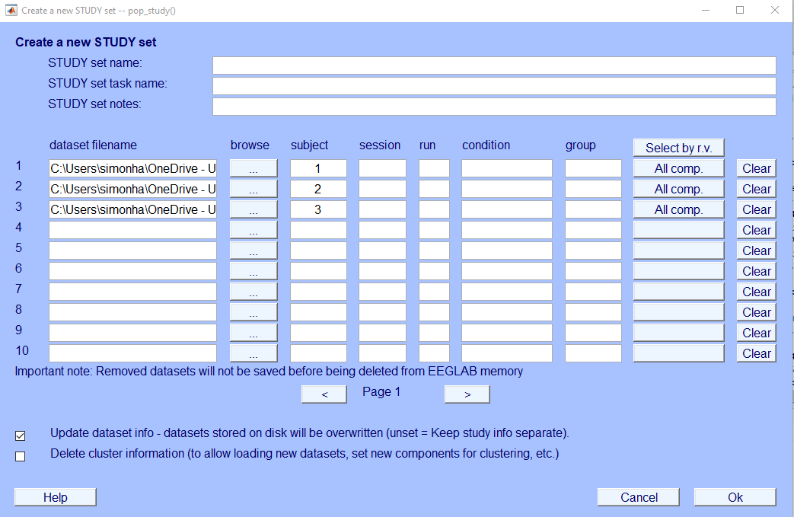
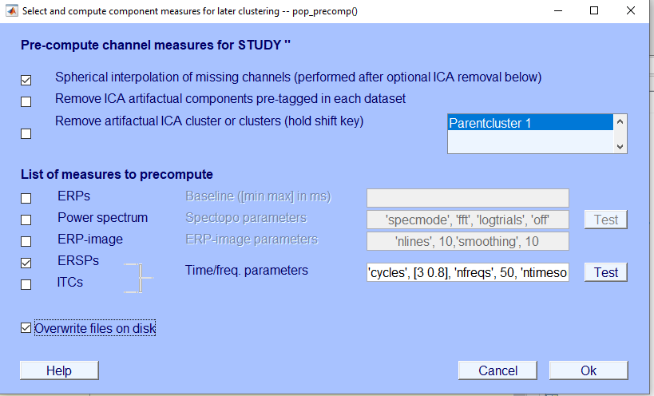
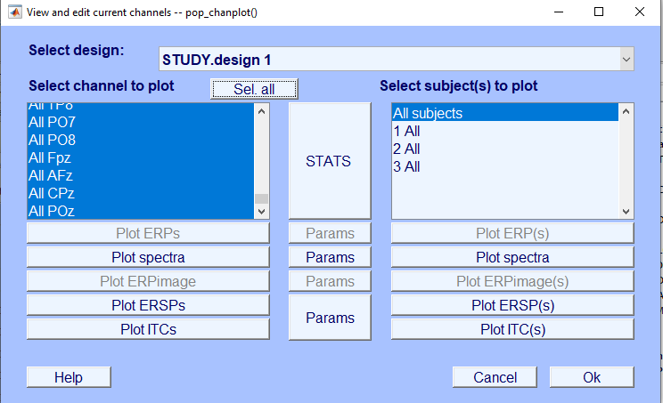
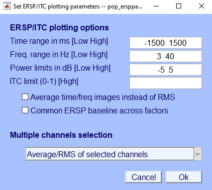
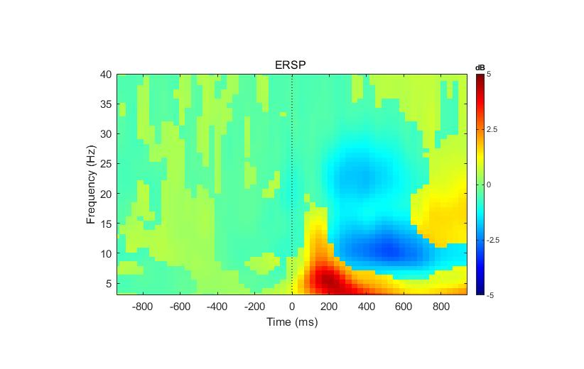
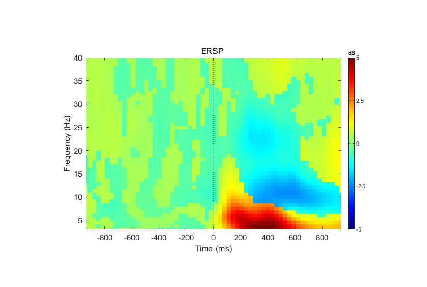

# Post-class: Basic analysis {#sec-analysis}

## Set up

If you wish to explore the dataset further, you can use the preprocessed samples to produce simple TFR spectrograms to think about the following questions: what is the response of the participant to the presentation of a go stimulus on the SART as opposed to a nogo stimulus?

To perform this section of the lab, open up the script `fim_analysis.m`

First, clean up EEGLAB:

[File › Clear Study / Clear All]{.menu}

Then, load in the first dataset you cleaned and apply the code to re-epoch it to only include trials where the stimulus was 4 or 7. The reason for this is that while there are more go trials to choose from, we are using a simple technique to down-sample and so match the trial number of the rarer nogo trials. Save your downsampled dataset separately and associate it with `_go` trials in the name.

Clear EEGLAB again and repeat this with the other dataset(s) you have prepped.

Then, start from the beginning, but this time run the code to separate out the nogo trials to get your nogo segment of the experiment.

::: {.callout-tip}
## Tip

If this part is too unclear, you can simply focus on producing a single TFR plot for the whole experiment.
:::

## Study

In the next step, you will make a simple EEGLAB study. This is to align all the samples together. This is a very basic approach and more advanced analysis typically goes beyond using EEGLAB, but for our purposes, it gives a simple start to doing EEG analysis.

Go to:

[File › Create Study › Browse Datasets › OK › Yes]{.menu}

Then, select all your datasets for one of the conditions only and add a subject label.

{width="85%" fig-alt="EEGLAB 'Create a new STUDY set' dialog with three dataset file paths entered and subject labels 1, 2 and 3."}

## Compute TF measures

Compute these using:

[Study › Precompute channel measures › select ERSPS]{.menu}

You can paste the following code into the parameters for the TFR calculation. If you want to experiment, you can try modifying this a bit:

```matlab
'cycles', [3 0.8], 'nfreqs', 50, 'ntimesout', 60, 'baseline', [-700 -200], 'freqs', [3 40], 'freqscale', 'linear'
```

{width="85%" fig-alt="EEGLAB 'Pre-compute channel measures for STUDY' dialog with ERSPs ticked and the time/frequency parameters pasted into the text box next to a Test button."}

::: {.callout-tip}
**TEST** it first, to see if it runs.
::: 

Then, you can press Ok to run the proper computation, which should finish in a couple minutes and your EEGLAB should become responsive again.

If it ends up blocking, press . You may need to revise your parameters to facilitate a quick analysis (lower `'ntimesout'`).

## Generate a plot

Time to plot the results of the TF transformation:

[Study › Plot Channel Measures › Sel. All › Params for ERSP › Plot ERSPs]{.menu}

You will likely want to use these parameters:

- [Time: -1500 1500]{.menu}
- [Frequency: 3 40]{.menu}
- [Plot averaged topography over time / free range OR Average/RMS of selected channels]{.menu}

Then, once you exit out, you press Plot ERSP(s) on the left to get your plot.

After inspection, you may want to unify your power limits to the same scale to facilitate comparisons.

Once you inspect your plot, decide on a unified scale for the colour axis (to facilitate comparison. Re-run the plotting.

::: {layout="[60,40]"}
{fig-alt="EEGLAB 'View and edit current channels' dialog with all channels selected, 'All subjects' selected and buttons for Plot ERSPs and Params."}

{fig-alt="EEGLAB ERSP/ITC plotting options dialog with time range -1500 to 1500 ms, frequency range 3 to 40 Hz, power limits -5 to 5 dB and 'Average/RMS of selected channels' chosen."}
:::

Save your plot:

[File › Save as › select a .jpg]{.menu}

## Nogo

Now, repeat this same procedure for the nogo segments of your datasets.

## Evaluate

Did you manage to get this far? You should have two plots which may look something like this:

::: {.callout-tip}
## Tip

In trying to interpret these clusters of activity, you may want to search for a paper on: alpha synchronisation or beta desynchronisation to make sense of the pattern you are detecting.
:::

## Solution

::: {.callout-note collapse="true"}
## Show the solution

Go:

{width="85%" fig-alt="ERSP time–frequency plot for go trials, from -900 to 900 ms and 3 to 40 Hz on a -5 to 5 dB scale. After the stimulus there is a strong low-frequency power increase (red, below about 10 Hz, peaking around 200 ms) and a clear power decrease (blue) in the alpha band around 500 ms and in the lower beta band, roughly 18 to 28 Hz, from about 250 to 500 ms."}

Nogo:

{width="85%" fig-alt="ERSP time–frequency plot for nogo trials on the same scale. The low-frequency power increase is stronger and longer, peaking around 300 to 400 ms, while the lower beta power decrease around 20 to 25 Hz is weaker than for go trials."}

My analysis shows that the lower beta negativity at the later time point is smaller in the nogo condition. This implies at least some involvement of this activity in motor planning and execution.
:::
