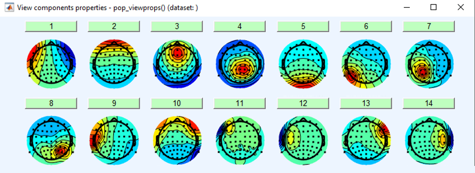
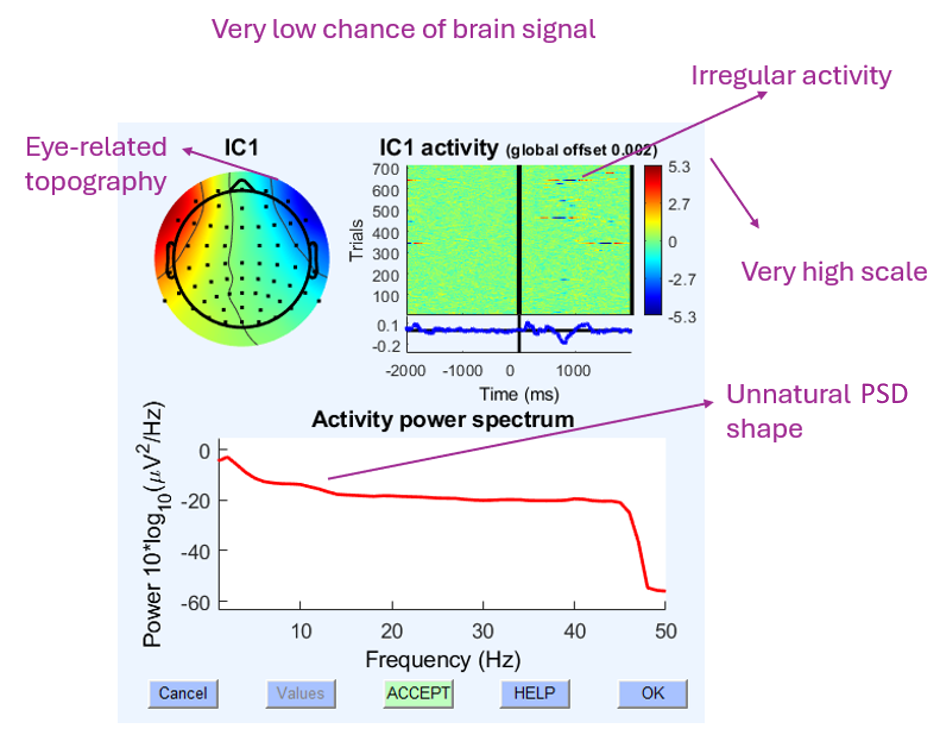
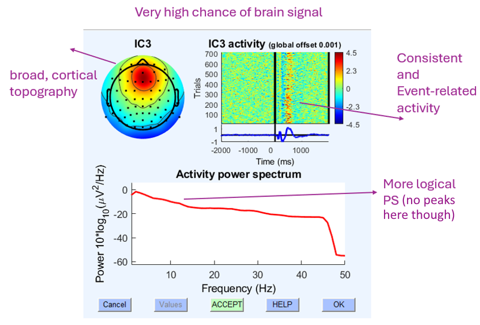
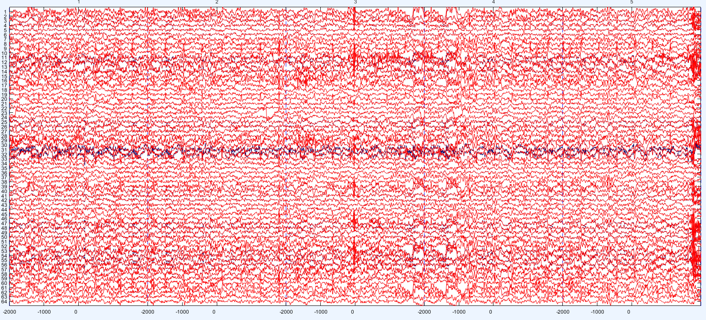
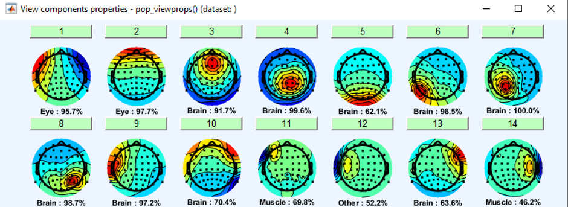
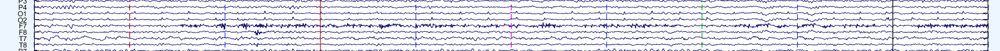
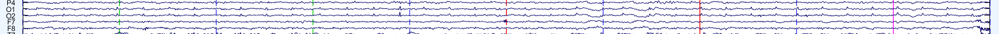
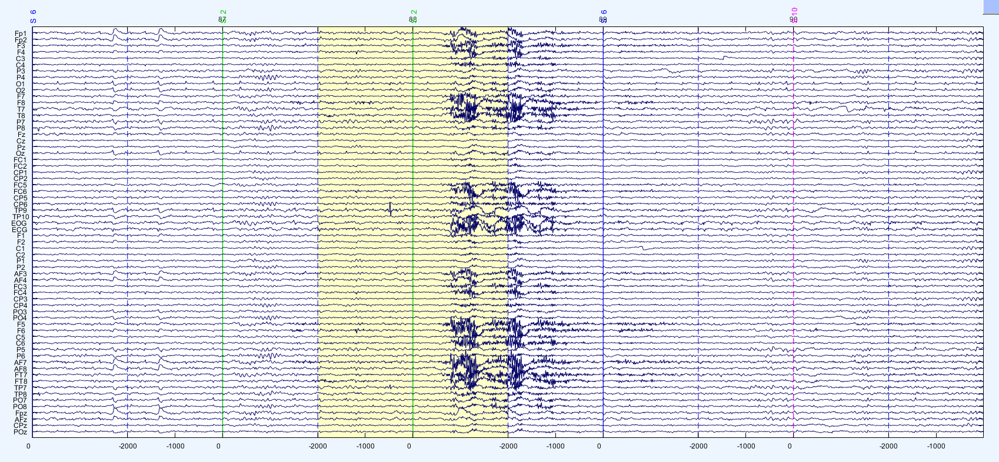
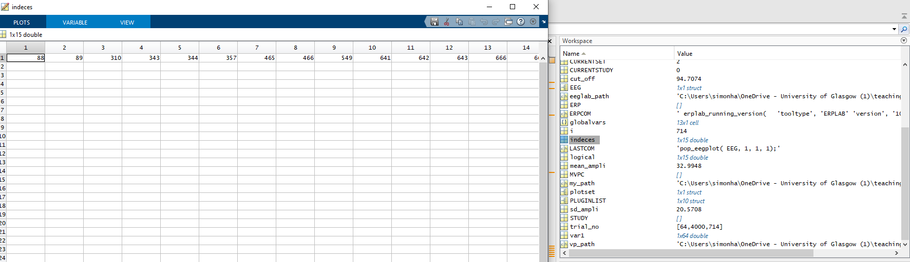

# In class: IC rejection  {#sec-cleaning}

## Setup

In today's practical lecture, you will work with lightly cleaned datasets and try to make your own decisions about noise in the dataset.

::: {.callout-note}
This is a sandbox exercise and you can choose which dataset you engage with.
::: 

You can choose to remove:

- A lot of noise → this might work well if you share your work with others
- Minimum noise → as it can still be valuable signal

I have done basic cleaning of the datasets in advance of the lab today, to make sure these are unified. You can also bring those you have cleaned yourself if you followed closely in the pre-class activity. For consistency, I do recommend that you use my versions.

There are 3 datasets for you to choose from. It is up to you which ones you will use (or choose to reject).

- **10001:** is a very clean dataset
- **10504:** is a relatively clean dataset.
- **15005:** is a messy dataset and an extra challenge. The participant reported dyslexia and struggled to keep to experimental instructions.

::: {.callout-important}
## Before you begin

**Please, ensure all your files are in one central folder, typically on the C: drive.**

**Please, use 7-Zip to unzip the EEGLAB folder, using the default file explorer zip would make it take too long. Follow:**

{fig-alt="Windows file explorer right-click menu on EEGLAB.zip, with 7-Zip then Extract Here selected."}
:::

Open the preprocessing script (`fim_pre-processing.m`) and run the first code segment to load EEGLAB. Then, load in your dataset.

[File › Load Existing Dataset]{.menu}

Then, your job is to improve the SNR in the dataset on an individual level. This can be achieved by multiple techniques, but we will mainly focus on removing ICAs in this lab.

::: {.callout-tip}
## Tips

- Keep track of changes you made in a text document!
- The steps can mostly be repeated!
- Work in groups with those around you to consult on your decisions.
- I will float around the lab and advise.
:::

::: {.callout-note}
## Thinking point

Reflect on the degree of subjectivity in these steps. Some are very conservative and are hesitant to label non-standard patterns as noise. Some are theory-driven and clean the dataset thoroughly.
:::

## Removing ICAs

The independent components identified in your datasets can be rejected if they managed to capture a strong amount of noise (as opposed to signal). As there are 64 components, judging each one by eye may prove difficult.

Use the following interface to display the components identified by ICA:

[Tools › Inspect/Label Components by Map]{.menu}

and show all of them

{fig-alt="EEGLAB 'View components properties' window showing scalp topography maps for independent components 1 to 14, each with a numbered button above it."}

To inspect a suspicious component, press the number. Try to focus on those with lower likelihood to be brain signal, or those classified as a particular type of artifact. I will outline two components, one very likely a brain component (signal) and one very likely to be noise.

::: {layout-ncol=2}
{fig-alt="Annotated properties of IC1, labelled 'Very low chance of brain signal': an eye-related frontal topography, irregular activity across trials, a very high colour scale and an unnatural power spectrum shape."}

{fig-alt="Annotated properties of IC3, labelled 'Very high chance of brain signal': a broad, cortical fronto-central topography, consistent event-related activity after the stimulus across trials and a more logical power spectrum without peaks."}
:::

Based on this information, you would likely remove IC1 and retain IC3.

To reject a component, click the accept button, this will flag it for removal.

Once your component was flagged, you can have a look at the adjustment this decision will make to the dataset. Go to

[Tools › Remove Components from data › Yes ›]{.menu}

**Then click plot single trials** to see what your change would cause.

{fig-alt="EEGLAB overlay plot of five epochs across 64 channels comparing data before (blue) and after (red) removing the flagged component. The largest difference is at channels 31 and 32."}

In our example here, the main adjustment is in channels 31, 32, which are the EOGs. This makes perfect sense in terms of this component to be driven by ocular artifact. You can then close this down and continue flagging components. You can keep coming back to this plot.

::: {.callout-tip}
## Tip

You should never observe a clear removal of the oscillating element of the signal. If a rejection of a particular component seems to remove the sinusoidal character of the signal, you are most likely rejecting signal!
:::

## Saving

Once your dataset is fully cleaned up, remember to save it!

[File › Save current dataset as.]{.menu}

See if you can get through at least two datasets.

## Communicate

Finally, post a snapshot of your cleaned signal (you can show the first couple of trials in the data scroll).

## Other techniques

You can try these techniques if you are more experienced or already finished with ICA rejection.

### Semi-automated rejection

Some have relied on semi-automated procedures by using an identifying algorithm trained on previous manual EEG analysis expert classifications. Your version of EEGLAB contains ICLabel to help with this.

[Tools › Classify Components using ICLabel › Label Components › Default setting]{.menu}

- You can have a look at the following option too and as artifacts and try to define your own ranges.

[Tools › Classify Components using ICLabel › Flag Components]{.menu}

You do not want to plot these through the ICLabel interface. Instead, just exit the menu offering to display these components, they will have already saved in your environment.

{fig-alt="The independent components previously identified, but this time with percentage probabilities of their tipe, including brain, eye or muscle artifact"}

### Channel interpolation

::: {.callout-important}
After you are finished with ICA component removal, you can move on to channel interpolation. This step should be done **after** ICA removal, since it changes the pattern of the identified components and makes it much harder to remove them.
:::

It is best practice to view the channel data at a scale of 50 μV. If you identify a particular channel as consistently noisy at this scale throughout much of the recording, one option is to interpolate it based on surrounding channels.

{fig-alt="Strip of the channel scroll showing channels P3 to T8, where F7 is visibly noisier than its neighbours."}

F7 appears to be consistently noisy. This could mean that the electrode site was consistently affected by a hardware fault or that its impedance was high. This happens during the data recording itself. To interpolate the electrode, follow:

[Tools › Interpolate electrodes › Select from data channels]{.menu}

And select the electrode / electrodes.

{fig-alt="The same strip of channels after interpolation, where F7 now looks similar to its neighbours."}

### Removing bad trials

- To remove bad trials, select trials as you scroll through the channel data scroll by simply clicking them.
- Manually removing trials is really an art in itself, but think about the following considerations
  - Any alteration in amplitude over 2SD over the mean is typically a sign of non-biological artefact. Automatic trial rejection procedures often employ this method.
  - Notice any wild changes in the signal. These could correspond to eye blinks, relative to stimulus presentation. If the noise occurs at the edge of the trial, the analysis is likely not going to consider that edge, so it can be left in the data.

{fig-alt="Epoched channel scroll showing trials 87 to 90. Trial 88 is highlighted in yellow and contains a burst of high-amplitude noise across many channels."}

You can also temporarily go back to your MATLAB script and run the bit of code to identify all trials with 3SD peaks in the dataset. The indices of the trials where this is the case will be stored in the variable `indeces`. You can see that the first automatically flagged trial is also 88. However, I would not remove 89, as the noise occurs over one second before the presentation of a stimulus, unlikely to have any impact on the later analysed signal.

{fig-alt="MATLAB variable editor showing the 1-by-15 variable indeces, starting 88, 89, 310, 343, 344, next to the workspace panel."}
