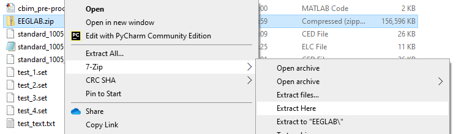
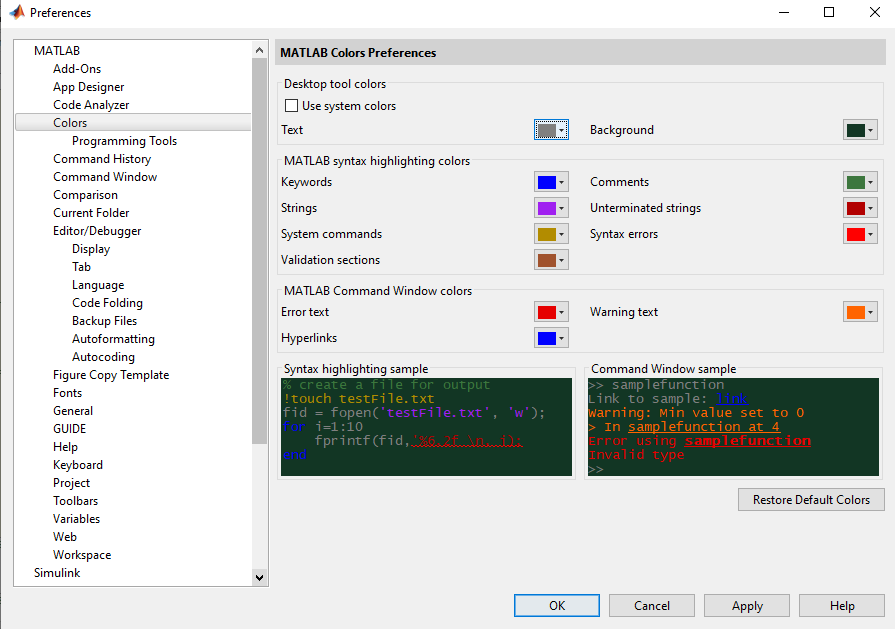
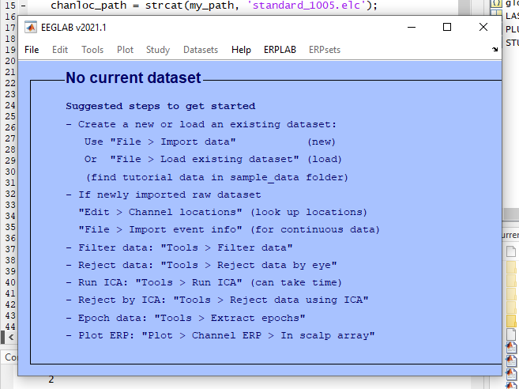
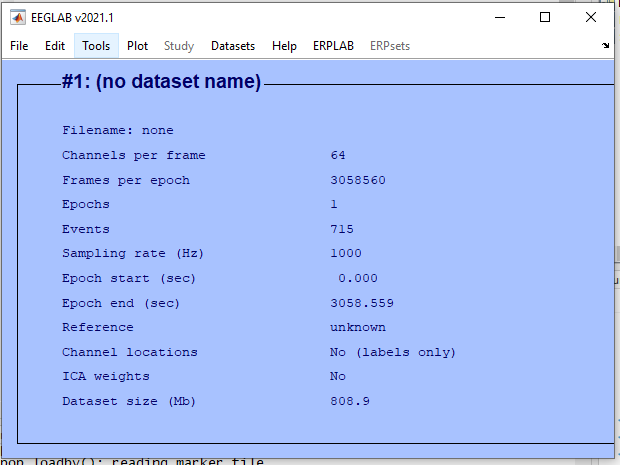
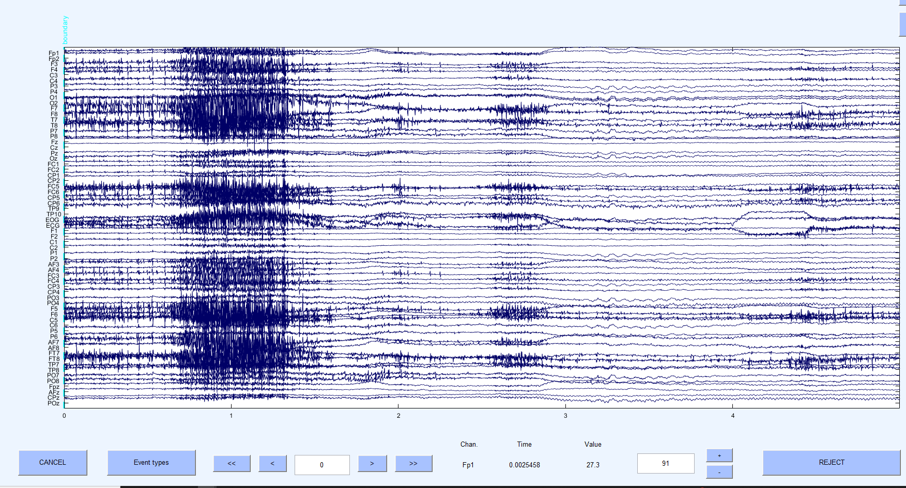
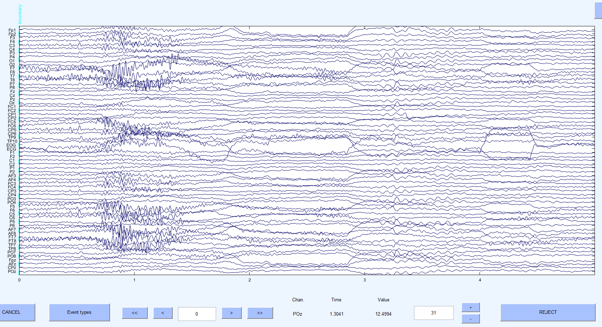

# Pre-class: Cleaning {#sec-preclass}

You will need to download the supporting files from the Moodle page ahead of the lab.

Make sure all files are in one folder.

::: {.callout-important}
## Use 7-Zip

Please, use 7-Zip to unzip the EEGLAB folder, using the default file explorer zip would make it take too long. Follow:

{fig-alt="Windows file explorer right-click menu on EEGLAB.zip, with 7-Zip then Extract Here selected."}
:::

## Accessibility

If you wish to customise MATLAB or make it more eye-friendly, to enable dark mode on MATLAB, you can navigate to:

[Home › Preferences (in the Environment tab) › Colors]{.menu}

And switch the text colour to a light colour and background colour to a dark one, as such:

{width="80%" fig-alt="MATLAB Preferences window with Colors selected. 'Use system colors' is unticked, the text colour is set to light grey and the background colour to dark green, and the syntax highlighting sample shows light code on a dark background."}

## Introduction

<!-- To embed the video, paste its link below and remove the comment markers:

-->

In this short guide, I will explain the process of preprocessing an EEG dataset like I have done before the class. This guide will help you to understand the basics of how MATLAB works and get more comfortable with the interface of MATLAB ahead of the class. It will also form your understanding of the data that we will be working with in class. Feel free to take this guide to one of our lab spaces and follow along with MATLAB open. Alternatively, you also have access to MATLAB licenses as part of your course, You can thus try this at home. Remember that there is no requirement to install MATLAB on your own devices. Equally, there is no requirement to use this pre-class script.

### About the dataset

First, let's talk a little bit about the data that we are working with. The data comes from my experiment comparing young and older healthy adult samples during the Sustained Attention to Response Task. This task is used to measure lapses in attention. It comprises of common "go" trials, where participants react to the presentation of a stimulus by pressing a key. In addition, there are random rarer "nogo" trials, where participants should not press any key in response to specific "nogo" stimuli. Commission errors happen in these trials and they have been linked to lapses in attention.

Trials were randomised and equally distributed for go stimuli (0–2, 4–5, 7–9) and nogo stimuli (3, 6).

The EEG recordings you will be working with were taken in a total of 720 trials, distributed across 8 blocks of about 5 minutes each, with short breaks in between, during which the EEG was running continuously.

Now that you know what data you are expecting. Let's open this up.

## Step-by-step guide

### Step 1: Setup

- Extract all the downloaded files into the same folder on the computer and note its location.
-Open up the first downloaded script (`fim_cleaning.m`) for undertaking data cleaning in MATLAB.
- Next, we can go step by step about what we do here. This can really be done with any of the datasets, but let's open the first one.
- We can see that the script contains different lines of code.

Those which start with `%%` are section headings. Here, we have section **`%% 0.`**, where you set up our environment.

- We also have lines starting with `%`, these are comments and are used for understanding what the code does,
- Code which runs does not start with any percentage signs. To run code, we use
  -  on Macs
  -  on Windows.

::: {.callout-tip}
The bottom should read "Busy" if MATLAB is doing something
::: 

As the very first step, we want to make sure that our environment is nice and clean, to do this, run the first line of code to clear our environment.

### Step 2: Load supporting information and the dataset

As a first step, we want to load some extra information about the dataset. At this stage, we need to do a small change to the code, we should point the script to the folder where all analysis information is stored. So, modify the path in the `my_path` variable to where you unzipped your project. Then, run the whole block of code. We also load in other supporting information, including the channel layout. A blue box will open up. This is the EEGLAB interface which will be used throughout the course.

{width="70%" fig-alt="The EEGLAB v2021.1 main window showing 'No current dataset' and a list of suggested steps to get started, open over the MATLAB script."}

As the script shows, we can use the interface to load in some data. To do so, we follow:

[File › Import Data › Using EEGLAB functions and plugins › from brain vision vhdr file]{.menu}

and just click ok after we find the file. There is no need to name the dataset. A small addition may have to be installed for this to work.

{width="70%" fig-alt="EEGLAB main window after import, showing dataset #1 with 64 channels, 1 epoch, 715 events, a sampling rate of 1000 Hz, no channel locations and no ICA weights."}

Let's have a look at the dataset as it is now. We do so by going to:

[Plot › Channel data (scroll)]{.menu}

{fig-alt="EEGLAB channel scroll plot of the raw continuous data across 64 channels, with large bursts of high-amplitude noise across many channels."}

We can jump to different time points and change the scale by inputting different numbers, as well as scroll.

Now, this is very messy indeed, so we can get rid of some of noise through very simple filtering at the next step.

### Step 3: Detrending and filtering

By running point 3. in the preprocessing script, the dataset is checked for consistency, channel locations are added. In addition, the dataset is detrended, which here means getting rid of slow drifts of exogenous origin found in the signal. Finally, the dataset is filtered. Filtering is a whole topic in itself, but here, applying a simple bandpass filter ensure that online signal at the frequencies 0.5 to 40 are visible, which are those likely to be of interest to us. Now that we filtered this dataset down to our broad frequencies of interest, this will help with further preprocessing and also help speed up some of the more analytic steps.

Let's have a look at our data now. But how is this done? The command:

```matlab
eeglab redraw;
```

needs to be run each time we want to see an update to the interface after running some script. After this, the script looks noticeable a bit cleaner, and we can actually see alpha oscillations right in there.

{fig-alt="EEGLAB channel scroll plot of the same data after detrending and band-pass filtering. The traces are much cleaner and rhythmic alpha oscillations are visible."}

### Step 4: Independent component analysis

Next, we would run the arguably most complicated pre-processing step. To catch artifacts, we typically use the algorithm of independent component analysis, to pick out regularly repeating patterns that occur in the signal and remove them as noise components. This procedure can be fully automated, but most research still utilises a semi-automated approach which we take here. Another big disadvantage of this procedure is that it takes a long time, often many hours, especially if iterating over a dataset with many samples.

::: {.callout-warning}
You may have to wait a long time for this to run, so I advise that you **skip point 4** and just try out the next steps without saving.
:::

This is also why we cannot really do this part in class.

### Step 5: Epoching and re-referencing

After waiting for some time, it is time to return to the cleaning. The next step is to break up this continuous stream into regular parts easier to analyse around a central element. This process is called epoching. The epoch of interest for us will revolve around the central stimulus (either go or nogo). This is also very helpful in terms of sorting trials into different conditions and skipping over breaks the participants took. And we can simply define what times around the stimulus we want to do. This is done through the epoching command in the script.

Finally, all EEG measurements and changes in amplitude are typically compared relative to a reference. Here, a running reference was preset to an electrode in a neutral location on the scalp. But it is typically better to recompute an average reference, using all an electrode average to better see an emergence of any patterns within an individual. And that is what we do here. By running the rereference command.

### Step 6: Saving

Now, we can see we have nicely pre-processed data and have access to components to pick up in our cleaning stage which we will do in the labs. I will go ahead and save this dataset. This is what we will work with in the labs. To save your own datasets, you would go to:

[File › Save current dataset as]{.menu}

I hope this was informative. You can have a go at this yourself but remember that this part of the preprocessing is a fairly automated and arguably boring procedure, so do not worry about this too much. In the lab, we will work the datasets the way I have pre-processed them, just to have consistency.

## Further learning

- You can read [the paper](https://pubmed.ncbi.nlm.nih.gov/41562398/) which features this dataset to familiarise yourself with the paradigm.
- Investigate papers on signal component classification, as these may be useful for your interpretation of our work in class.
