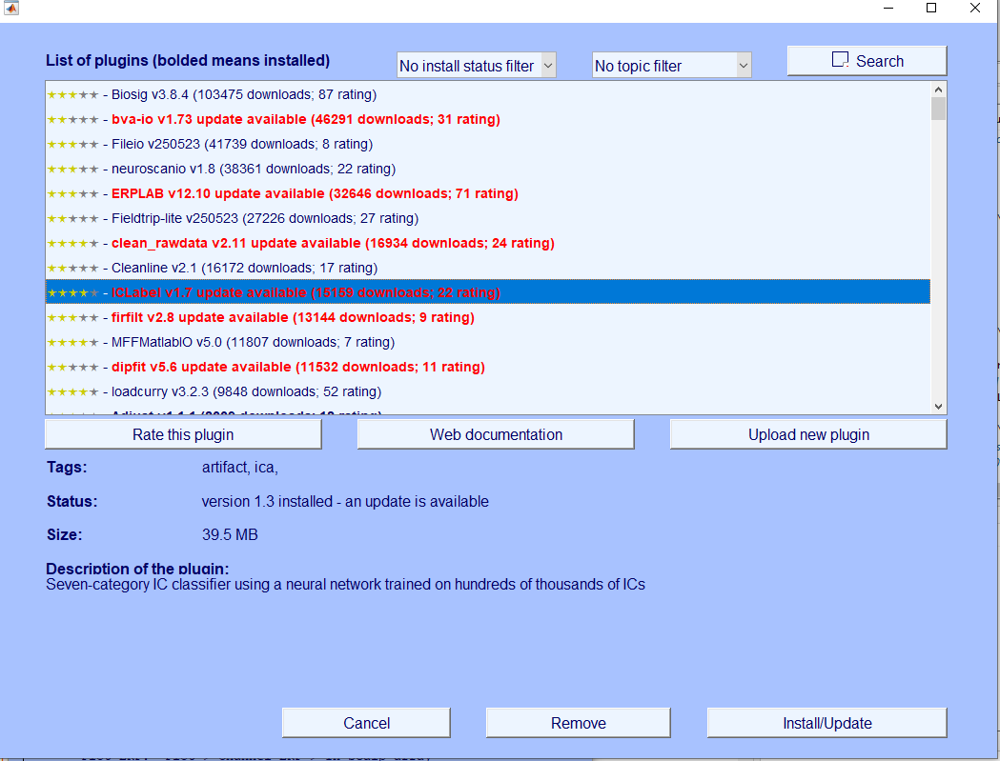

# Extra: MATLAB troubleshooting {#sec-troubleshooting}

::: {.callout-note}
This is an extra chapter. It is not part of the practical itself, but you can come back to it whenever something in MATLAB or EEGLAB does not work as expected.
:::

## A window popped up asking me to rename the file

You can always just ignore these windows and press OK to continue.

## EEGLAB.M not found

This may happen if you try to download EEGLAB directly, the version can be corrupt and not run properly, use the one I provided.

## EEGLAB taking forever to unzip

Do not use the default unzipping app, but use 7-Zip.

## A step is taking long

Do wait for a WHILE, some steps may take a couple of minutes. If MATLAB runs into error, you can press  to abort the process.

## I only managed to process one dataset and can't make a study

No problem, you can make a study even using a single dataset.

## I can't get ICLabel to work

Version issues are likely the case, especially if using lab computers. You do not need ICLabel for the exercise. You can try it on your device later if desired.

## Problems with path

If your path is not setting correctly, make sure you are using the `\` sign, not `/`

## Installing modules

To install a module, go to:

[File › Manage EEGLAB Extensions]{.menu}

In the list of plugins, find and install, the relevant module, such as **ICLabel**.

{width="70%" fig-alt="EEGLAB plugin manager listing available plugins with ratings and download counts. ICLabel is selected, its status reads 'version 1.3 installed - an update is available', and the Install/Update button is at the bottom right."}

## Run out of disk space

Work on one dataset at a time and delete older versions in their traces.
